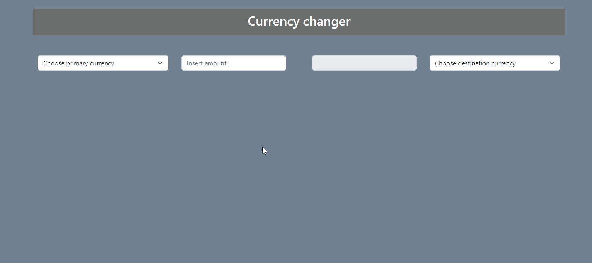
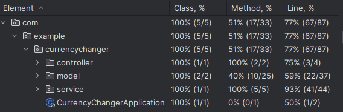

## About

The application serves to check currency conversion.

## Technologies

- Spring Boot / Java
- Maven
- Thymeleaf
- JS
- Gson Library
- AssertJ

## API

The current currency data is provided by [NBP](http://api.nbp.pl/).

## Usage Example

Run the application and use it on localhost in your browser, default address is http://localhost:8080.

## Tests

Service methods are covered by unit tests.

Project was made for learning purposes.

Use freely.
