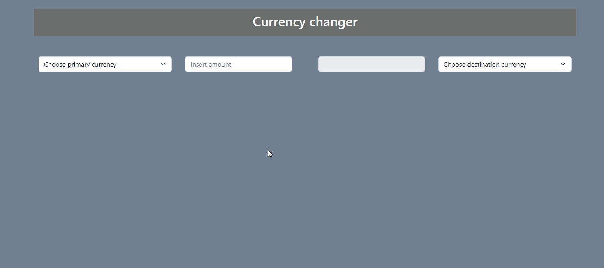

## About
The application is used to check currency conversion.

## Technologies

- Spring Boot / Java
- Maven
- Thymeleaf
- JS
- Gson Library

## API

The data on current currency values come from [NBP](http://api.nbp.pl/).

## Usage Example

Project was made for learning purposes.

Use freely.
